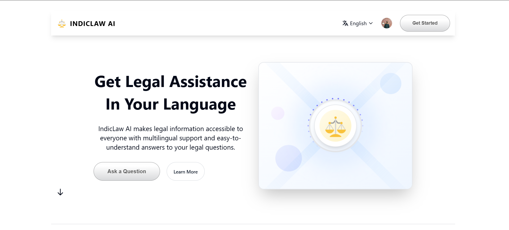
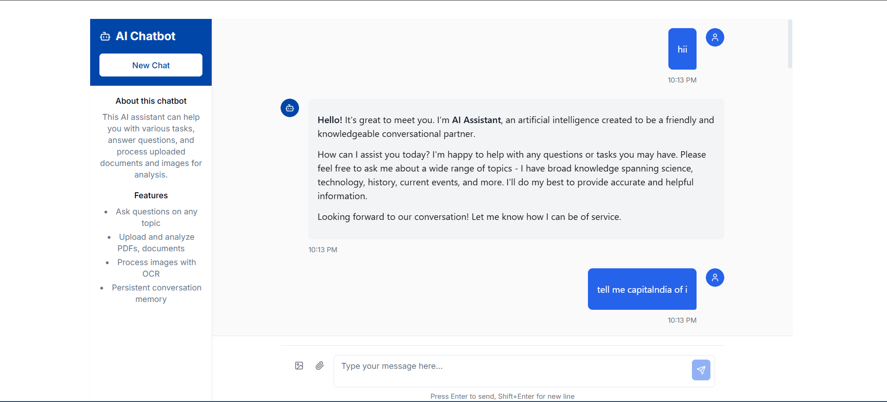

# IndicLaw AI - Multilingual Legal Assistance Chatbot

IndicLaw AI is an intelligent chatbot system designed to provide legal information and assistance in multiple Indian languages. Built with modern technologies and focused on accessibility, this application makes legal information comprehensible and available to everyone through its multilingual support and user-friendly interface.




## 📑 Table of Contents

- [Features](#features)
- [Project Structure](#project-structure)
- [Technologies Used](#technologies-used)
- [Getting Started](#getting-started)
  - [Prerequisites](#prerequisites)
  - [Installation](#installation)
  - [API Key Configuration](#api-key-configuration)
- [Usage](#usage)
- [API Reference](#api-reference)
- [Multilingual Support](#multilingual-support)
- [Document Processing](#document-processing)
- [Deployment](#deployment)
- [Contributing](#contributing)
- [License](#license)

## ✨ Features & Architecture

### Core Features

#### Multilingual Legal Assistance
- Support for 8 Indian languages: English, Hindi, Marathi, Bengali, Tamil, Telugu, Gujarati, and Kannada
- Real-time language switching without losing context
- Consistent terminology across languages
- Language preference persistence

#### Document Processing & Analysis
- Support for multiple document formats:
  - PDF documents with text extraction
  - Microsoft Word (DOCX) files
  - Image-based documents with OCR
- Batch processing capabilities
- Document summarization
- Key information extraction
- File size limit: 10MB per upload

#### Intelligent Chat Interface
- Context-aware responses
- Progressive loading of chat history
- Real-time typing indicators
- Code and citation formatting
- Markdown support for rich text
- Error handling with graceful degradation

#### Security & Authentication
- Firebase Authentication integration
- JWT-based API security
- Rate limiting and request validation
- Secure file upload handling
- CORS protection
- Password hashing with bcrypt

#### User Experience
- Responsive design (mobile-first approach)
- Dark/Light theme support
- Offline capability with service workers
- Persistent chat history
- Custom UI components with Shadcn
- Loading states and animations

### Technical Architecture

#### Frontend Architecture
- Component-based structure with React
- State management with Context API
- Type-safe development with TypeScript
- Performance optimization:
  - Code splitting
  - Lazy loading
  - Memoization
  - Asset optimization

#### Backend Architecture
- RESTful API design
- Modular service architecture
- Middleware-based request processing
- Error handling middleware
- File processing pipeline
- Caching mechanisms

#### Database Schema
- User profiles
- Chat sessions
- Message history
- Document metadata
- User preferences
- System configurations

#### Security Measures
- Input validation
- XSS protection
- CSRF protection
- Rate limiting
- File type validation
- Secure headers

## 📂 Project Structure

The project follows a modern, scalable architecture split into frontend and backend services:

### Backend (Node.js/Express)
```bash
backend/
├── config/                 # Application configuration
│   └── index.js           # Configuration management
├── middleware/            # Express middleware
│   ├── auth.js           # Authentication middleware
│   └── logger.js         # Request logging
├── models/               # MongoDB schemas
│   ├── chatMessage.js    # Chat message model
│   ├── chatSession.js    # Session management
│   ├── document.js       # Document metadata
│   ├── user.js          # User model
│   └── userPreference.js # User settings
├── routes/               # API endpoints
│   ├── auth.js          # Authentication routes
│   ├── chat.js          # Chat functionality
│   ├── chatDB.js        # Chat persistence
│   └── documents.js      # Document handling
├── services/            # Business logic
│   ├── documentService.js    # Document processing
│   ├── ollamaClient.js      # AI model integration
│   └── userPreferenceService.js # User preferences
├── utils/               # Utility functions
│   ├── fileProcessor.js  # File handling
│   ├── imageProcessor.js # Image processing
│   └── responseFormatter.js # Response formatting
├── uploads/             # File upload directory
├── test/               # Test files
└── server.js           # Application entry point
```

### Frontend (React/TypeScript/Vite)
```bash
frontend/
├── public/              # Static assets
│   ├── _redirects       # Netlify redirects
│   ├── robots.txt       # Search engine rules
│   └── favicon.svg      # Site icon
├── src/
│   ├── components/      # React components
│   │   ├── ui/         # Shadcn UI components
│   │   ├── ChatInput.tsx     # Message input
│   │   ├── ChatMessage.tsx   # Message display
│   │   └── ChatSidebar.tsx   # Navigation
│   ├── contexts/        # React contexts
│   │   ├── AuthContext.tsx   # Authentication
│   │   └── LanguageContext.tsx # i18n
│   ├── hooks/          # Custom React hooks
│   │   └── use-mobile.tsx    # Responsive
│   ├── i18n/           # Internationalization
│   │   └── locales/    # Language files
│   ├── lib/            # Utility functions
│   │   ├── api.ts      # API client
│   │   └── firebase.ts # Firebase config
│   ├── pages/          # Route components
│   │   ├── Index.tsx   # Home page
│   │   ├── Login.tsx   # Auth pages
│   │   └── Profile.tsx # User settings
│   └── styles/         # CSS/styling
│       ├── global.css  # Global styles
│       └── sidebar.css # Component styles
├── package.json        # Dependencies
├── tsconfig.json      # TypeScript config
├── vite.config.ts     # Vite configuration
└── tailwind.config.ts # Tailwind CSS config
```

## 🚀 Technologies Used

### Backend Stack
- **Node.js** (v18+) - JavaScript runtime environment
- **Express** (v5.1.0) - Fast, unopinionated web framework
- **OpenRouter API** - AI model integration for intelligent responses
- **MongoDB** (with Mongoose v8.18.1) - Database for chat history and user data
- **Multer** (v2.0.1) - Middleware for handling file uploads
- **pdf-parse** (v1.1.1) - PDF document text extraction
- **Mammoth** (v1.9.1) - DOCX file processing
- **Tesseract.js** (v6.0.1) - OCR for image text extraction
- **JWT** (v9.0.2) - Authentication and session management
- **Bcrypt** (v6.0.0) - Password hashing
- **CORS** - Cross-Origin Resource Sharing support

### Frontend Stack
- **React** (v18) - UI framework with hooks and functional components
- **TypeScript** - Static typing for better developer experience
- **Vite** - Next-generation frontend build tool
- **Tanstack Query** (v5.56.2) - Powerful data synchronization
- **i18next** - Robust internationalization framework
- **Shadcn UI** - Beautiful, accessible component system
- **Radix UI** - Headless UI components for composable interfaces
- **Lucide Icons** - Modern icon set
- **Firebase** (v11.9.1) - Authentication and real-time features
- **Tailwind CSS** - Utility-first CSS framework
- **Class Variance Authority** - Dynamic className construction

### Development Tools
- **ESLint** - Code linting and style enforcement
- **Nodemon** - Development server with hot reload
- **Git** - Version control
- **VS Code** - Recommended IDE with preconfigured settings

## 🚀 Getting Started

### Prerequisites

- Node.js (v18 or higher)
- npm (v8+) or Yarn
- MongoDB (v6+) instance
- OpenRouter API key
- Firebase project (for authentication)
- Git

### Installation

1. Clone the repository:
```bash
git clone https://github.com/vaibhavchauhan-15/IndicLaw.git
cd IndicLaw

# Create configuration files from templates
cp backend/.env.example backend/.env
cp frontend/.env.example frontend/.env
git clone https://github.com/yourusername/indiclaw.git
cd indiclaw
```

2. Install backend dependencies
```bash
cd backend
npm install
```

3. Configure environment variables:

Backend `.env` configuration:
```bash
# Server Configuration
PORT=5000
NODE_ENV=development
FRONTEND_URL=http://localhost:5173

# Database
MONGODB_URI=mongodb://localhost:27017/indiclaw

# API Keys
OPENROUTER_API_KEY=your_openrouter_api_key
REFERER_URL=http://localhost:5173

# Authentication
JWT_SECRET=your_jwt_secret_key
JWT_EXPIRY=7d

# Application Settings
SITE_TITLE=IndicLaw AI
UPLOAD_PATH=uploads
MAX_FILE_SIZE=10485760  # 10MB in bytes
```

Frontend `.env` configuration:
```bash
VITE_API_URL=http://localhost:5000
VITE_ENVIRONMENT=development

# Firebase Configuration
VITE_FIREBASE_API_KEY=your_firebase_api_key
VITE_FIREBASE_AUTH_DOMAIN=your_auth_domain
VITE_FIREBASE_PROJECT_ID=your_project_id
VITE_FIREBASE_STORAGE_BUCKET=your_storage_bucket
VITE_FIREBASE_MESSAGING_SENDER_ID=your_sender_id
VITE_FIREBASE_APP_ID=your_app_id
```

4. Install frontend dependencies
```bash
cd ../IndicLaw
npm install
```

### API Key Configuration

The application uses OpenRouter API to access various AI models including GPT-4o, Claude 3 Haiku, and more. Follow these steps to set up your API key:

1. Create an account on [OpenRouter](https://openrouter.ai/)
2. Generate an API key from your dashboard
3. Add the API key to your `.env` file as `OPENROUTER_API_KEY`

To verify your API key is working properly:
```bash
cd backend
npm run test-api-key
```

This will test the API connection and confirm if your OpenRouter API key is valid and working properly.

If you encounter a "401 No auth credentials found" error, try these troubleshooting steps:
1. Check if your API key is correct in the `.env` file
2. Ensure the API key starts with `sk-or-`
3. Verify you have available credits in your OpenRouter account
4. Generate a new API key from the OpenRouter dashboard if needed

## 🖥️ Usage

1. Start the backend server
```bash
cd backend
npm run dev
```

2. Start the frontend development server
```bash
cd IndicLaw
npm run dev
```

3. Visit `http://localhost:5173` in your browser

### VS Code Tasks

This project includes VS Code tasks for easier development:

- **Start Frontend**: Run the React frontend
- **Start Backend**: Run the Node.js backend

## 📡 API Reference

### Chat Endpoint
```
POST /api/chat
```

**Request Body:**
- `message`: User's message (text)
- `file`: (Optional) Attached document or image

**Response:**
- AI-generated response with relevant legal information

### Health Check
```
GET /health
```

Returns the current status of the server.

## 🌐 Multilingual Support

IndicLaw supports the following languages:

- English
- Hindi
- Marathi
- Bengali
- Tamil
- Telugu
- Gujarati
- Kannada

Language preferences are saved in the browser's local storage for a consistent experience.

## 📄 Document Processing

The application can process various document types:

- **PDF**: Extract text content for analysis
- **DOCX**: Extract text from Microsoft Word documents
- **Images**: Use OCR to extract text from images

## 🚀 Deployment

The frontend of IndicLaw can be deployed to Vercel for fast and reliable hosting:

### Vercel Deployment

For detailed instructions on deploying the frontend to Vercel, see the [Vercel Deployment Guide](./frontend/VERCEL_DEPLOYMENT.md).

If you encounter any errors during deployment, refer to the [Vercel Error Codes Reference](./frontend/VERCEL_ERROR_CODES.md) for troubleshooting common error codes.

### Backend Deployment

The backend can be deployed to platforms like:
- Heroku
- Render
- Digital Ocean
- AWS
- Google Cloud Platform

Make sure to update the environment variables in your frontend deployment to point to the deployed backend URL.

## � Development & Testing

### Development Workflow

1. **Local Development**
   ```bash
   # Terminal 1 - Backend
   cd backend
   npm run dev

   # Terminal 2 - Frontend
   cd frontend
   npm run dev
   ```

2. **Code Quality**
   ```bash
   # Backend
   cd backend
   npm run lint

   # Frontend
   cd frontend
   npm run lint
   ```

3. **Build Production**
   ```bash
   # Backend
   cd backend
   npm run build

   # Frontend
   cd frontend
   npm run build:prod
   ```

### Testing

1. **API Testing**
   ```bash
   # Test API key configuration
   cd backend
   npm run test-api-key

   # Test Ollama integration
   npm run test-ollama
   ```

2. **Database Migration**
   ```bash
   cd backend
   npm run migrate
   ```

3. **Frontend Type Checking**
   ```bash
   cd frontend
   npm run typecheck
   ```

## �🤝 Contributing

1. Fork the repository
2. Create a feature branch (`git checkout -b feature/amazing-feature`)
3. Follow the code style guidelines:
   - Use ESLint configuration
   - Write meaningful commit messages
   - Add appropriate documentation
4. Test your changes thoroughly
5. Commit your changes (`git commit -m 'Add amazing feature'`)
6. Push to the branch (`git push origin feature/amazing-feature`)
7. Open a Pull Request with detailed description
   - What does this implement/fix?
   - Does this close any currently open issues?
   - Testing instructions

## � Troubleshooting

### Common Issues

1. **API Key Issues**
   - Ensure OpenRouter API key starts with `sk-or-`
   - Check API key permissions and quotas
   - Verify environment variables are loaded correctly

2. **File Upload Errors**
   - Check file size (max 10MB)
   - Verify supported file formats
   - Ensure upload directory permissions

3. **MongoDB Connection**
   - Verify MongoDB is running
   - Check connection string format
   - Ensure network connectivity

4. **Build Issues**
   - Clear node_modules and reinstall
   - Check Node.js version compatibility
   - Verify all dependencies are installed

### Performance Optimization

1. **Frontend Performance**
   - Enable code splitting
   - Implement lazy loading
   - Optimize image assets
   - Use production builds

2. **Backend Performance**
   - Implement caching strategies
   - Optimize database queries
   - Use connection pooling
   - Enable compression

3. **Memory Management**
   - Monitor memory usage
   - Implement cleanup routines
   - Handle file uploads efficiently

## 📈 Performance Metrics

- Time to First Byte (TTFB): < 200ms
- First Contentful Paint (FCP): < 1.8s
- Largest Contentful Paint (LCP): < 2.5s
- First Input Delay (FID): < 100ms
- Cumulative Layout Shift (CLS): < 0.1

## �📝 License

This project is licensed under the ISC License. See the [LICENSE](LICENSE) file for details.

## 🙏 Acknowledgments

- OpenRouter API for AI model access
- Firebase team for authentication
- MongoDB team for database
- Open source community

---

Built with ❤️ by Team Cornelia

© 2025 IndicLaw AI. All Rights Reserved.
